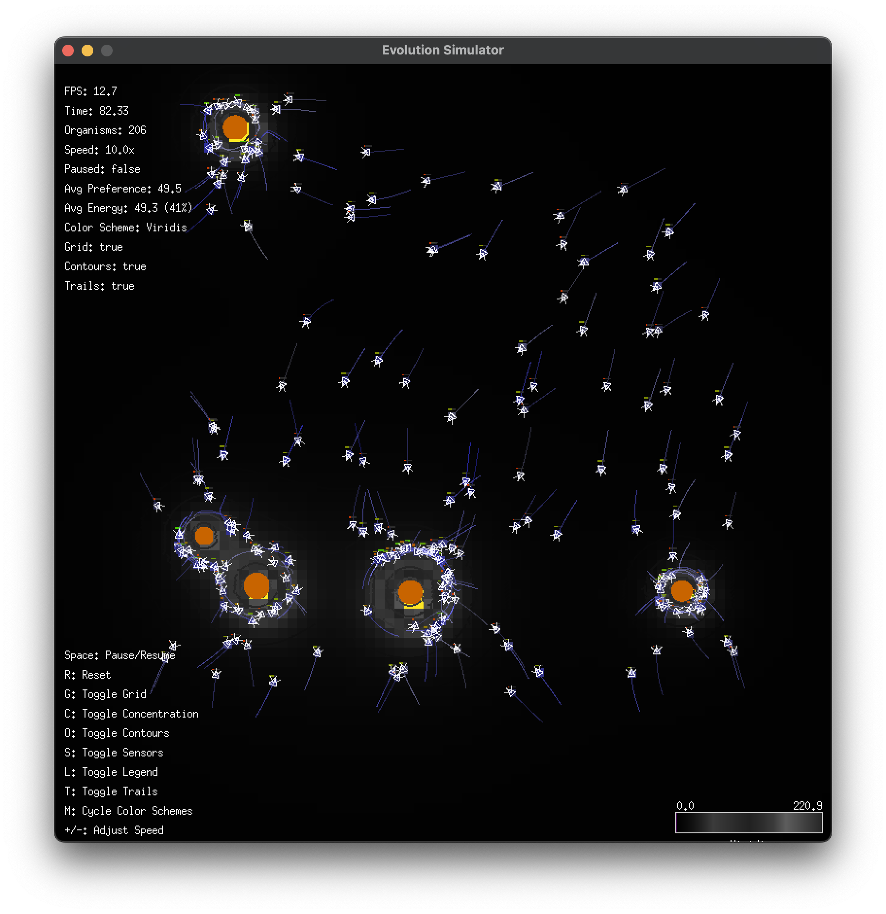

# Evolutionary Simulator v0.1.0

A 2D simulation of single-cell organisms responding to chemical gradients in their environment. The simulation focuses on emergent behavior through individual organism preferences and directional sensing.

## Features

- Single-cell organisms with directional sensing (front, left, right)
- Static chemical sources creating concentration gradients
- Organisms have individual chemical preferences (normally distributed)
- Greedy movement algorithm toward preferred concentration
- Visualization with contour lines showing chemical gradients
- Energy system with consumption during movement
- Reproduction with mutations when organisms reach energy threshold

## Screenshot



The simulation in action, showing organisms (white) clustering around chemical sources (orange). The interface displays real-time statistics and supports keyboard controls for toggling visualization options.

### Keyboard Controls

- `Space`: Pause/Resume simulation
- `R`: Reset simulation
- `G`: Toggle grid display
- `C`: Toggle concentration visualization
- `O`: Toggle contour lines
- `S`: Toggle organism sensors
- `L`: Toggle legend
- `T`: Toggle movement trails
- `M`: Cycle color schemes
- `+/-`: Adjust simulation speed

## Building and Running

```bash
# Build the project
go build -o run_evolve_sim ./cmd/evolve_sim

# Run the simulator
./run_evolve_sim
```

```bash
# run tests
go test -v ./...
# dev
go run main.go
```

## Configuration

The simulation can be configured using a JSON file. Copy `config_example.json` to `config.json` and modify as needed:

```bash
# Use a custom configuration
./run_evolve_sim -config=my_config.json
```

## Project Structure

- `cmd/evolve_sim`: Main application entry point
- `pkg/types`: Core data structures
- `pkg/config`: Configuration system
- `pkg/world`: World and chemical gradient system
- `pkg/organism`: Organism behavior and movement
- `pkg/simulation`: Simulation engine
- `pkg/renderer`: Visualization system

## Documentation

- `current_todos.md`: Active development tasks and upcoming features
- `archived_docs/`: Completed implementation plans, tutorials, and reference docs
- `spec.md`: Original project specifications and requirements

## License

This project is licensed under the MIT License - see the LICENSE file for details.
